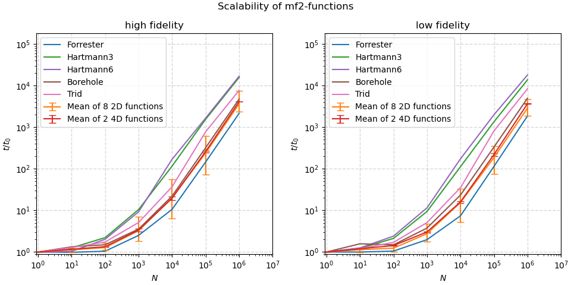
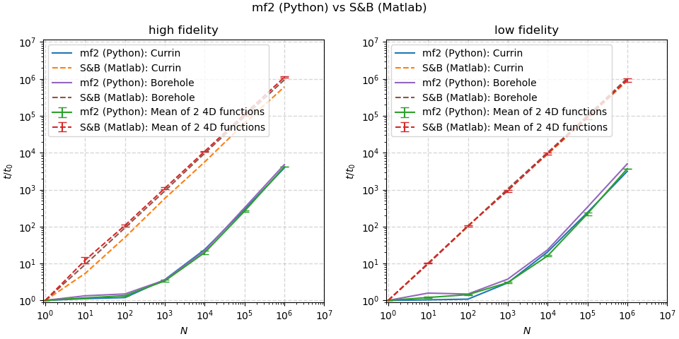

Performance
===========

Where possible, all functions are written using `numpy <https://numpy.org/>`_
to make use of optimized routines and vectorization. Evaluating a single
point typically takes less than 0.0001 seconds on a modern desktop system,
regardless of function. This page shows some more detailed information about the
performance, even though this library should not be a bottleneck in any
programs.

The scripts for generating following performance overviews can be found in the
`docs/scripts <https://github.com/sjvrijn/mf2/tree/master/docs/scripts>`_ folder
of the repository. Presented running times were measured on a desktop PC with an
Intel Core i7 5820k 6-core CPU, with Python 3.6.3 and Numpy 1.18.4.

Performance Scaling
-------------------

The image below shows how the runtime scales as ``N`` points are passed to the
functions simultaneously as a matrix of size ``(N, ndim)``. Performance for the
high- and low-fidelity formulations are shown separately to give a fair
comparison: many low-fidelities are defined as computations on top of the
high-fidelity definitions. As absolute performance will vary per system, the
runtime is divided by the time needed for ``N=1`` as a normalization. This is
done independently for each function and fidelity level.

Up to ``N=1_000``, the time required scales less than linearly thanks to
efficient and vectorized numpy routines.

Performance Comparison
----------------------

The following image shows how the scaling for the ``mf2`` implementation of the
**Currin**, **Park91A**, **Park91B** and **Borehole** functions compares to the
*Matlab* implementations by `Surjanovic and Bingham
<https://www.sfu.ca/~ssurjano/multi.html>`_, which can only evaluate one point
at a time, so do not use any vectorization. Measurements were performed using
*Matlab* version R2020a (9.8.0.1323502).

